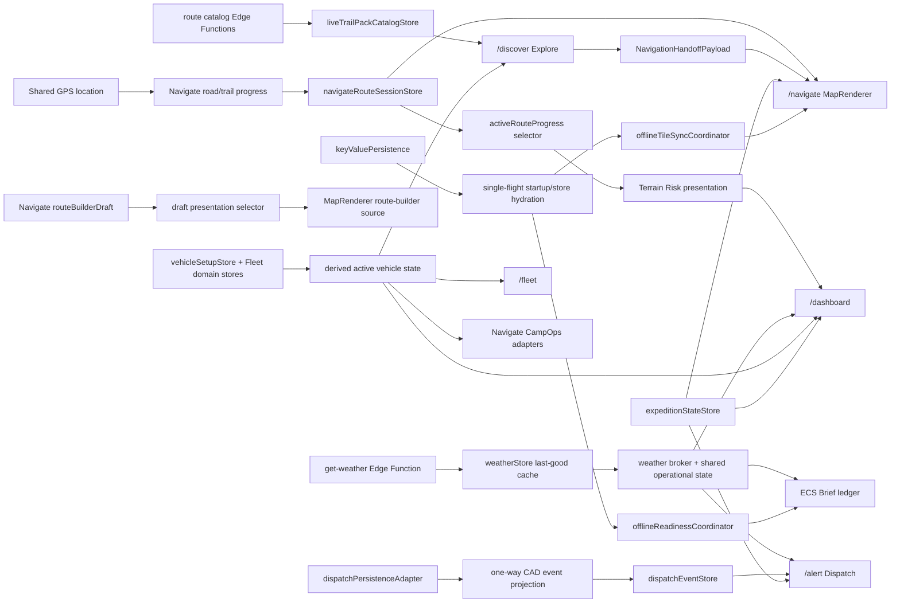

# Cross-system hydration and update propagation

Last audited: 2026-07-16

This document records the runtime wiring in the current local ECS implementation for the eight affected state paths. It treats the mounted application and the current working tree as the source of truth. It is not evidence of Android, iOS, GPS, Mapbox, Supabase, or live-provider behavior.

Status terms used below:

- **Repaired**: the incorrect transition has a bounded implementation repair and focused behavioral coverage in the current tree.
- **Partial**: the primary path is repaired, but a mounted edge, transport cancellation, or cross-surface contract remains open.
- **Open**: the first incorrect transition is still present and is named explicitly.
- **Unproven**: the code path is coherent, but it still requires provider, bundle, native, or field evidence.

## Runtime flow

The arrows are one-way data flow. Adapters and selectors derive presentation state; they do not write results back into their producers.

## 1. GPS to route progress to Navigate to Terrain Risk to Dashboard

| Required field | Current runtime contract |
| --- | --- |
| 1. Authoritative producer | `lib/sharedGPSLocation.ts` owns the raw location watcher and `GPSPosition`. The mounted road/trail guidance hooks in `app/(tabs)/navigate.tsx` own route-progress calculation and publish the normalized cross-screen session through `lib/navigateRouteSessionStore.ts`. Terrain Risk is derived; it is not another route owner. |
| 2. Normalized contract | Raw location uses `GPSLocationOutput`/`GPSPosition`. Cross-screen route state uses `NavigateRouteSessionSnapshot` plus `NavigateRouteSessionHydrationState`. Consumers use `ActiveRouteProgressSnapshot`, then `TerrainRiskDashboardPresentation`, whose profile, progress, source, confidence, and missing-data reason are explicit. |
| 3. Event or subscription mechanism | `useThrottledGPS` acquires the shared GPS store. `useRoadNavigation`/`useTrailNavigation` update Navigate state and `navigateRouteSessionStore`. `useActiveRouteProgressSnapshot` subscribes to route, Navigate-session, and vehicle changes. Dashboard React state/memos derive the Terrain Risk presentation. |
| 4. Persistence/hydration owner | Raw GPS is never persisted. `navigateRouteSessionStore` uses migrating non-secure storage and joins one restore flight; road/trail session stores remain their domain persistence owners. Terrain samples are request presentation state, not a second persisted route. |
| 5. Consumer selector | `getActiveRouteProgressSnapshot`/`useActiveRouteProgressSnapshot`; `buildTerrainRiskCommandRoute`; `buildTerrainRiskDashboardPresentation`; `selectUpcomingTerrainRiskBannerEvent`. Guidance projection uses the pure functions in `lib/navigation/guidanceRouteProjection.ts`. |
| 6. Mounted component | `/navigate` mounts `app/(tabs)/navigate.tsx` and `components/navigate/MapRenderer.tsx`. `/dashboard` mounts `app/(tabs)/dashboard.tsx` to `WidgetGrid` to `WidgetRenderers`. Both the Attitude Command terrain preview and the separately selectable `terrain-risk` card/detail cases mount the same `useTerrainRiskDashboardRuntime` presentation through `AttitudeCommandTerrainRiskPreview`. |
| 7. Expected update frequency | Native/web GPS follows the shared store's high-accuracy or balanced policy. UI delivery is throttled to roughly one update per second. Route projection may update with accepted GPS samples; expensive elevation sampling is keyed to route geometry/signature rather than every GPS tick. Expedition tracking notifications are microtask-coalesced. |
| 8. Cleanup behavior | The GPS watcher is reference-counted, stops when the last consumer releases or the app backgrounds, and uses a generation guard against old callbacks. Hook subscriptions release on unmount. Terrain sampling cancels/supersedes older work. Route replacement resets projection continuity. |
| 9. Source/freshness semantics | GPS retains raw coordinates, accuracy, timestamp, permission, fix quality, and watching state; a stopped watcher is not treated as a fresh live fix. Navigate sessions distinguish `stateOrigin: live\|restored` and `freshness: live\|cached\|stale`. Terrain source classification preserves origin, freshness, confidence, coverage, provider, and observation time. |
| 10. Current failure point | **Repaired in code.** The late-restore overwrite in `navigateRouteSessionStore` is repaired with hydration generation and mutation-revision guards. Canonical completed/remaining guidance splitting is repaired without overwriting raw GPS. The standalone `terrain-risk` card/detail cases now subscribe to the same route-progress/elevation runtime as Attitude Command, including source/freshness, sampling terminal states, request supersession, progress, and retry. |

Focused coverage: `scripts/test-navigate-route-session-hydration.js`, `scripts/test-guidance-route-projection.js`, `scripts/test-active-guidance-live-gps-progress.js`, `scripts/test-dashboard-terrain-risk-presentation.js`, `scripts/test-dashboard-terrain-risk-runtime-source.js`, `scripts/test-dashboard-terrain-risk-runtime-bridge.js`, and `scripts/test-expedition-state-propagation.js`.

Required evidence: native GPS permission/background behavior, Mapbox projection and style reload, an actual near-route/off-route field trace, and native visual evidence for the standalone Terrain Risk graph with real route elevation samples.

## 2. Weather broker to operational weather to Dashboard, ECS Brief, and Dispatch

| Required field | Current runtime contract |
| --- | --- |
| 1. Authoritative producer | `supabase/functions/get-weather/index.ts` owns provider-secret access. `lib/weatherStore.ts` owns normalized forecast/last-good cache truth. `lib/weatherBroker.ts` owns shared request execution and cache policy. `lib/useOperationalWeather.ts` owns the active shared presentation/request lifecycle for mounted consumers. |
| 2. Normalized contract | Provider output is normalized into `WeatherFetchResult` and `ECSWeatherSnapshot`. Request presentation uses `ECSAsyncSurfaceState<WeatherFetchResult>` with request identity, generation, fingerprint, times, source/freshness, last-good data, safe error, retry, provider state, cancellation, and result count. |
| 3. Event or subscription mechanism | Each `useOperationalWeather` call registers a consumer in the shared module store; equivalent consumers share the same request. `subscribeSharedOperationalWeather` drives mounted presentation updates. `startSharedWeatherBriefPublication` is leased once by `app/_layout.tsx` and publishes shared snapshots to the Brief ledger independently of Dashboard or Dispatch mounting. AppState foreground changes request policy refreshes. |
| 4. Persistence/hydration owner | `weatherStore` owns the weather cache and cache timestamps. The shared operational layer hydrates cached data first, but cache hydration does not mark a live attempt complete. Brief publication is derived and ledger-deduplicated; it is not another weather cache. |
| 5. Consumer selector | `useOperationalWeather` resolves coordinate-first GPS/route/selected/last-known targets and returns `{snapshot, result, refresh}`. Dashboard weather helpers in `WidgetRenderers`, `WeatherIntelPanel`, the Brief publisher, and Dispatch presentation consume that shared result without clearing one another's state. |
| 6. Mounted component | Dashboard: `/dashboard` to `app/(tabs)/dashboard.tsx` to `WidgetGrid`/`WidgetRenderers` to `WeatherIntelPanel`. ECS Brief: the embedded `CommandBriefScreen`, fed by the root publication coordinator. Dispatch: canonical `/alert` to `DispatchCadCommandCenter`, which registers a focus-gated weather consumer. |
| 7. Expected update frequency | Initial eligible mount, explicit retry, material location movement, freshness expiry, and foreground refresh. GPS jitter below `WEATHER_LOCATION_STALE_DISTANCE_METERS` does not create another provider request. Failed attempts observe the bounded retry cooldown. |
| 8. Cleanup behavior | Consumer registration, presentation listeners, the no-consumer grace timer, and the AppState subscription are released. Superseded/unmounted waits are cancelled and guarded by request generation. **Residual:** the `AbortController` currently cancels the operational wait, but its signal is not threaded through `fetchSharedWeatherForCoordinates` to the Edge Function transport. A safe transport repair must add subscriber leases at the operational, broker-bucket, and weather-store dedupe boundaries so one unmount cannot abort another consumer's identical request. |
| 9. Source/freshness semantics | Only a usable, error-free provider response is `live`. Provider cache/stale responses remain cached/stale; a failure preserves last-good data as stale/degraded. Provider, forecast validity timestamps, location-source label, cached time, and safe error remain distinct. Permission denial and invalid target are terminal, not loading. |
| 10. Current failure point | **Partial.** Broker normalization now preserves provider source/cached timestamps/errors; stale hydration no longer suppresses the first real request; Dashboard and Dispatch consumers are focus-retained; root-owned Brief publication prevents one consumer from consuming another's update. Cross-consumer location leakage is repaired: location continuity is now accepted only through the explicit `ECSWeatherTargetInput.previousLocation` contract. Transport-level abort remains unimplemented because the three current dedupe boundaries share bare promises without subscriber ownership. |

Focused coverage: `scripts/test-weather-broker.js`, `scripts/test-operational-weather-async-lifecycle.js`, `scripts/test-operational-weather-consumer-retention.js`, `scripts/test-weather-location-ownership.js`, `scripts/test-weather-cache-hydration.js`, `scripts/test-dashboard-weather-rendering-regression.js`, and `scripts/test-dispatch-shared-weather-brief.js`.

Required evidence: a configured Supabase project, real provider response, Android/iOS location permission states, real offline transition, and foreground refresh. Provider credentials must remain server-side.

## 3. Route catalog to geometry detail to Explore to Navigate

| Required field | Current runtime contract |
| --- | --- |
| 1. Authoritative producer | `public.verified_routes` exposed through the security-invoker public catalog view and the `route-catalog-search`/`route-catalog-detail` Edge Functions. `lib/explore/liveTrailPackCatalog.ts` is the normalized mobile catalog owner. `lib/navigationHandoffStore.ts` owns the staged Explore-to-Navigate handoff. |
| 2. Normalized contract | `LiveTrailPackCatalogSnapshot` contains catalog arrays, diagnostics, coverage/search metadata, source, refresh key, and `ECSAsyncSurfaceState<LiveTrailPackCatalogData>`. Detail geometry remains in canonical `ECSTrailPack` geometry fields and is versioned by route/source. Navigate receives a `NavigationHandoffPayload`. |
| 3. Event or subscription mechanism | `/discover` subscribes to `liveTrailPackCatalogStore`. Search and detail requests use keyed shared-request maps with subscriber leases. Detail reconciliation emits one catalog update. Navigate loads the staged handoff on focus and passes it through `applyExploreNavigationPayload`. |
| 4. Persistence/hydration owner | Search summaries use the route-catalog summary persistent cache. Detail geometry uses the bounded versioned detail cache. The handoff store owns web/native key-value restore. Explore filter persistence is separate and must not mutate catalog truth. |
| 5. Consumer selector | `exploreWizardTrailPackSourceRoutes` feeds `buildExploreGuidanceReadyInventory`; typed exclusion reasons explain not-ready routes. Navigate consumes `loadNavigationHandoffPayload`/`applyExploreNavigationPayload`, then route lifecycle and MapRenderer consume the canonical geometry. |
| 6. Mounted component | `/discover` is registered in `lib/routeManifest.ts` and mounts `app/(tabs)/discover.tsx`. The handoff target is `/navigate`, mounting `app/(tabs)/navigate.tsx` and `MapRenderer`. |
| 7. Expected update frequency | Initial/focus refresh, material search criteria change, pagination, explicit retry, and deliberate per-route detail load. Identical concurrent search/detail requests share execution; detail concurrency is bounded by the current Explore loader. |
| 8. Cleanup behavior | Effects abort on criteria/context change or unmount. Shared requests cancel when no subscriber remains. Refresh sequence, request identity, source version, refresh key, and detail reconciliation target reject stale search or geometry completion. |
| 9. Source/freshness semantics | Catalog source remains `route_catalog`, `trail_packs_fallback`, or `unavailable`; request presentation distinguishes ready, empty, stale, degraded, disabled, cancelled, and error. Cached summary/detail data keeps its route/source version. Supplemental geometry never becomes access or legality evidence. |
| 10. Current failure point | **Repaired, provider unproven.** Detail completion previously returned only to its caller; the top-level catalog selector never received the newly drawable geometry, so readiness could remain false. `captureRouteCatalogDetailReconciliationTarget` and `reconcileRouteCatalogDetail` now atomically replace only the matching route/source version in live, async, and last-good collections and emit once. |

Focused coverage: `scripts/test-explore-live-trail-pack-catalog-refresh-stability.js`, `scripts/test-explore-guidance-ready-routes.js`, `scripts/test-route-catalog-integration.js`, `scripts/test-route-catalog-search-provider-contract.js`, and the runtime-regression Explore scenario.

Required evidence: deployed Edge Functions/migration, real RLS/auth behavior, at least one approved qualified route, pagination at provider scale, Android handoff restore, and partner-restricted geometry checks.

## 4. Route builder to draft geometry to MapRenderer

| Required field | Current runtime contract |
| --- | --- |
| 1. Authoritative producer | Screen-local `routeBuilderDraft` plus `NavigateRouteDraftHistory` in the mounted Navigate screen. Snapping enriches legs but does not become a second draft owner. |
| 2. Normalized contract | `NavigateRouteDraft` contains anchors and legs. `NavigateRouteGeometryRole` distinguishes `raw_user_draft`, `snapped_draft`, `finalized_route`, `preview_route`, and `active_guidance_route`. `RouteBuilderSegmentFromDraft` carries raw and snapped coordinate series, snap state/source/confidence, warnings, and provisional truth. |
| 3. Event or subscription mechanism | Map long-press/draw events call Navigate handlers, which update React draft/history state. `buildRouteBuilderPresentationSegmentsFromDraft` and `routeBuilderMapSegments` memoize the presentation passed to `MapRenderer`. No event bus or bidirectional store mirror is used. |
| 4. Persistence/hydration owner | The live draft intentionally has no application-wide persistence owner; its lifetime is the mounted Navigate route. Preview/finalization hand off through the existing route lifecycle/store. Style and orientation changes reuse the current React draft rather than rehydrate another copy. |
| 5. Consumer selector | `buildRouteBuilderPresentationSegmentsFromDraft`, the `routeBuilderMapSegments` memo, and `routeBuilderDraft.anchors`. MapRenderer receives `routeBuilderActive`, `routeBuilderSegments`, `routeBuilderAnchors`, and a distinct draft color. |
| 6. Mounted component | `/navigate` to `app/(tabs)/navigate.tsx` to `components/navigate/MapRenderer.tsx`. The renderer owns the stable `route-builder-source` and its unique halo, line, and endpoint layers. |
| 7. Expected update frequency | Every accepted anchor changes the line immediately. High-volume freehand updates are frame/rate bounded and isolated to the route-builder overlay patch family; unrelated map sources are not rebuilt. |
| 8. Cleanup behavior | Undo/redo replace the same draft presentation. Cancel clears draft/history and aborts snap work. Unmount releases pending controllers. Map style reload replays the source/layers from current props. Finalization transitions roles without leaving a duplicate preview source. |
| 9. Source/freshness semantics | Draft segments are explicitly provisional and preserve snap provider/confidence/warnings. Raw operator geometry is never labeled official, legal, verified, or guidance-ready. Finalized, preview, and active guidance geometries remain separate roles. |
| 10. Current failure point | **Repaired, native rendering unproven.** The mounted renderer previously depended on preview-oriented geometry. The current path always derives presentation segments from the live draft and passes them before preview; two valid anchors create line geometry, and draft/active sources no longer overwrite each other. |

Focused coverage: `scripts/test-route-builder-draft-visibility.js`, `scripts/test-route-builder-undo-behavior.js`, `scripts/test-route-builder-cancel-cleanup.js`, and `scripts/test-map-route-rendering-overlays.js`.

Required evidence: Android/iOS gesture delivery, Mapbox/WebView z-order, style reload, orientation transition, and an active-guidance-plus-draft visual capture.

## 5. Dispatch store to canonical Dispatch route and component

| Required field | Current runtime contract |
| --- | --- |
| 1. Authoritative producer | `dispatchPersistenceAdapter` owns durable local schema-v7 CAD state for an expedition/account scope. Canonical Supabase repositories own configured cloud state. `dispatchEventStore` owns the currently visible event feed. `dispatchPersistenceEventProjection` is a one-way adapter between those distinct states. |
| 2. Normalized contract | Durable state is `DispatchPersistenceSnapshot`; feed rows are `DispatchEvent`; local hydration uses `ECSAsyncSurfaceState<DispatchPersistenceSnapshot>`. Persistence identity prefers live expedition cloud ID, then local expedition ID, then convoy ID, then an account-scoped fallback. |
| 3. Event or subscription mechanism | `dispatchPersistenceAdapter.subscribe` emits changed scope IDs. `subscribeDispatchPersistenceCadEvents` revision-dedupes and projects only persistable CAD/recovery events while retaining non-persisted live events. The mounted component separately subscribes to `dispatchEventStore`. |
| 4. Persistence/hydration owner | `dispatchPersistenceAdapter.waitForHydration` is the local single-flight boundary. The canonical component starts projection only after the current scoped hydration is terminal. Optional cloud repository/realtime hydration remains independently auth/RLS gated. |
| 5. Consumer selector | `resolveDispatchLocalPersistenceId`, `isPersistableLocalDispatchEvent`, and `subscribeDispatchPersistenceCadEvents`. The component prefers `liveCurrentExpeditionDispatchId` rather than a stale legacy expedition lookup. |
| 6. Mounted component | `lib/routeManifest.ts` registers canonical `/alert`. `app/(tabs)/alert.tsx` imports the compatibility export `components/dispatch/DispatchCommandCenter.tsx`, which re-exports the sole implementation `DispatchCadCommandCenter.tsx` with `dispatch-canonical-command-center`. |
| 7. Expected update frequency | One visible projection for each new durable revision; equivalent snapshots are deduped. Account, expedition, or convoy identity changes replace the scoped hydration and projection lease. Live feed events continue at their own producer rate. |
| 8. Cleanup behavior | The projection lease unsubscribes on context change/unmount. Local hydration aborts on retry/context change/unmount. The adapter ignores other expedition IDs. Replacing presentation events does not write back to persistence, preventing a circular propagation loop. |
| 9. Source/freshness semantics | Local restored data is cached/offline-capable; cloud/realtime state is live only when configured and authenticated. Disabled/unavailable/offline/error states remain explicit in the Dispatch surface state. Account-scoped fallback prevents signed-out or switched-account cross-contamination. |
| 10. Current failure point | **Repaired, cloud unproven.** Local/canonical hydration could advance the persistence revision without updating `dispatchEventStore`, and tests masked it with manual `replaceEvents`. The mounted component now installs the scoped one-way projection after hydration and replaces it when expedition/account context changes. |

Focused coverage: `scripts/test-dispatch-local-cad-persistence.js`, `scripts/test-dispatch-entry-surface.js`, `scripts/test-dispatch-runtime-hardening.js`, and the runtime-regression Dispatch integration scenario. The local persistence test covers late update, wrong scope, account isolation, duplicate consumers, equivalent-update dedupe, circular guard, and cleanup.

Required evidence: real Supabase auth/RLS/realtime, account/logout on device, background/foreground replay, and proof that web and Android bundles resolve the same canonical module.

## 6. Active vehicle to Fleet to Explore compatibility to CampOps to Dashboard

| Required field | Current runtime contract |
| --- | --- |
| 1. Authoritative producer | `vehicleSetupStore` owns active selection. `vehicleStore`, `vehicleSpecStore`, `consumablesStore`, `tiresLiftStore`, `loadoutStore`, and `loadoutItemStore` own their domain records. `lib/fleet/activeVehicleState.ts` is a derived composite, not a second writable vehicle store. |
| 2. Normalized contract | `ECSVehicularState` and the thinner `ActiveVehicleContext` expose identity, readiness, weight/payload, modifications, capability, center of gravity, source labels, confidence, partial-data reasons, warnings, and a stable signature. |
| 3. Event or subscription mechanism | `subscribeActiveVehicleState` attaches upstream subscriptions only while a consumer exists. Selection changes publish immediately. Same-vehicle domain changes are filtered and microtask-coalesced into a revisioned event with safe producer diagnostics. |
| 4. Persistence/hydration owner | Each Fleet domain store owns its persistence. `waitForActiveVehicleStateHydration` joins all required stores, and `ecsStartupHydration` includes their required tasks. The derived active-vehicle adapter has no duplicate persistence. |
| 5. Consumer selector | `getActiveVehicleState`, `getActiveVehicleContext`, Explore compatibility derivation, Navigate's `navigateVehicleContext`, CampOps route-context adapters, and Dashboard's active-vehicle context refresh. |
| 6. Mounted component | `/fleet` mounts `app/(tabs)/fleet.tsx`. `/discover` subscribes in `app/(tabs)/discover.tsx`. `/navigate` subscribes and supplies vehicle context to CampOps. `/dashboard` subscribes and passes the active context into `WidgetGrid`/`WidgetRenderers`. |
| 7. Expected update frequency | Active selection publishes once per switch. Changes to the active vehicle's spec, consumables, tires/lift, loadout, or items coalesce per microtask. Mutations for non-active vehicles do not broadly invalidate Explore, Navigate, CampOps, or Dashboard. |
| 8. Cleanup behavior | The last active-vehicle consumer detaches every upstream source subscription and cancels a queued notification generation. Screen effects unsubscribe and cancel stale async record loads when focus or active vehicle changes. |
| 9. Source/freshness semantics | Weight and capability fields retain manual/store/spec source, confidence, estimate/partial flags, and unknown values. Explore fallback compatibility is labeled fallback. The active Fleet selection is the current operational vehicle; historical route `build_snapshot.vehicle_id` is used only when Fleet has no active selection. |
| 10. Current failure point | **Repaired in code.** Navigate previously allowed a historical route build snapshot to pin CampOps and readiness to an old vehicle after Fleet selection changed. `getActiveVehicleContextWithFallback` now prefers the active Fleet ID, `activeVehicleRevision` invalidates Navigate's memo, and `profileSignature` participates in every CampOps route-context key. A behavioral A-to-B switch contract now proves the same selection event updates Explore compatibility, CampOps input/fingerprint, and Dashboard's render key without duplicate selection invalidation. |

Focused coverage: `scripts/test-fleet-active-vehicle-state.js`, `scripts/test-dashboard-attitude-active-vehicle-binding.js`, `scripts/test-explore-guidance-ready-routes.js`, `scripts/test-campsite-navigation-integration.js`, and Fleet runtime tests.

Required evidence: a native mounted cross-tab vehicle switch, persisted cold/warm restore, CampOps recomputation with a real active route, logout/account separation, and device performance under rapid loadout edits.

## 7. Active expedition to Dashboard to Dispatch to Navigate

| Required field | Current runtime contract |
| --- | --- |
| 1. Authoritative producer | `lib/expeditionStateStore.ts` is the intended canonical runtime owner for the current expedition, lifecycle, tracking, timeline, and cloud session identity. `missionExpeditionStore` is a legacy duplicate and must not remain a runtime identity source. |
| 2. Normalized contract | `ExpeditionRecord` plus `ExpeditionState` (`standby`, active lifecycle states, and completion states) is the producer contract. `ExpeditionRuntimeSnapshot` adds hydration (`restoring\|ready\|error`), source (`none\|restored\|live`), freshness (`missing\|cached\|current`), revision, active record, and safe hydration code without becoming another writable owner. Dashboard, Dispatch, and Navigate derive presentation/context models and do not mirror mutations back into expedition state. |
| 3. Event or subscription mechanism | `expeditionStateStore.subscribe` emits revisioned mutation/hydration/tracking events. Tracking writes are microtask-coalesced. Each mounted screen reads the current snapshot immediately, then subscribes so late consumers see the restored identity before the next event. |
| 4. Persistence/hydration owner | `expeditionStateStore` uses the `ecs_expedition_*` key-value namespace and exposes `waitForExpeditionStateHydration`; optional startup hydration includes `active_expedition`. Cloud synchronization is downstream of the local canonical record. |
| 5. Consumer selector | `expeditionStateStore.getRuntimeSnapshot`/`getCurrentExpedition`/`getState`; Dashboard expedition runtime; Dispatch's live expedition dispatch ID; Navigate's subscribed `expeditionRuntime`. The mounted pin/export context derives active/paused identity from the canonical runtime snapshot. |
| 6. Mounted component | `/dashboard` mounts `app/(tabs)/dashboard.tsx`; `/alert` mounts canonical `DispatchCadCommandCenter`; `/navigate` mounts `app/(tabs)/navigate.tsx`. All three subscribe to the canonical store for primary operational state. |
| 7. Expected update frequency | Begin/pause/resume/end/switch publishes immediately. Rapid GPS tracking changes coalesce. A cloud acknowledgment may enrich the same identity but must not replace a newer local expedition. |
| 8. Cleanup behavior | Screen subscriptions return and invoke unsubscribe. Coalesced tracking does not retain a per-screen timer. Dispatch replaces its scoped projection subscription when the expedition changes. Old cloud/realtime subscriptions must be replaced by their owning adapters. |
| 9. Source/freshness semantics | Before native restore completes, consumers receive `restoring/none/missing`. Accepted persisted state is `ready/restored/cached`; a local begin, switch, or tracking mutation is `ready/live/current`; hydration failure is terminal `error` with a safe code. Pre-hydration local writes are replayed over disk by `keyValuePersistence`, so restored data cannot replace a newer live mutation. |
| 10. Current failure point | **Repaired in code.** Navigate's pin/export branch previously memoized the duplicate `missionExpeditionStore` identity forever; it now derives active/paused identity from subscribed `expeditionRuntime`. Navigate and Dispatch consume the typed canonical runtime snapshot, Dispatch does not let a legacy identity own the restoring interval, and its scoped projection lease is replaced on expedition switch. Stale prior-expedition updates are rejected. |

Focused coverage: `scripts/test-expedition-state-propagation.js` verifies late consumers, rapid tracking coalescing, A-to-B identity/Dispatch lease replacement, stale-A rejection, diagnostics, and cleanup. `scripts/test-expedition-runtime-hydration.js` verifies `restoring/none/missing` to `ready/restored/cached` to live replacement. `scripts/test-key-value-persistence-hydration-race.js` covers pre-hydration mutation replay.

Required evidence: native cold/warm restore, active expedition switch while all three tabs are mounted/restored, real cloud acknowledgment ordering, account switch, and background/foreground tracking.

## 8. Offline cache to restored stores to visible source states

| Required field | Current runtime contract |
| --- | --- |
| 1. Authoritative producer | `lib/keyValuePersistence.ts` owns native/web key-value hydration ordering. Domain stores remain owners of their data. For the affected offline UI, `offlineReadinessCoordinator` owns manifests and `offlineTileSyncCoordinator` owns sync jobs; neither owns connectivity. |
| 2. Normalized contract | Shared async surfaces use `ECSAsyncSurfaceState`. Offline readiness exposes `OfflineReadinessCoordinatorHydrationState` (`restoring\|ready\|error` plus source/times/safe code) and typed manifests/assets. Tile sync exposes `OfflineTileSyncSnapshot` with job terminal states plus `hydrationStatus`, `sourceState`, `hydratedAt`, and `hydrationErrorCode`. |
| 3. Event or subscription mechanism | Persistent caches expose one hydration promise. Coordinators notify subscribers once restored and after accepted mutations. `expeditionReadinessStore` subscribes to readiness changes; Navigate UI subscribes to tile jobs. `ecsStoreHydrationCoordinator` dedupes startup task flights. |
| 4. Persistence/hydration owner | `keyValuePersistence` journals set/delete/clear operations made before disk restore, replays them over the restored cache, and defers native flush until hydration. Required/optional startup plans join store hydration; optional startup now includes both offline readiness and tile sync. |
| 5. Consumer selector | `offlineReadinessCoordinator.getLatestForRoute`/`audit`; `expeditionReadinessStore`'s offline input; `offlineTileSyncCoordinator.getSnapshot`; `OfflineSyncStatusChip`; `OfflineCacheModal`. `OfflineStateBanner` selects connectivity only and must not be used as cache freshness. |
| 6. Mounted component | Navigate mounts `OfflineSyncStatusChip` and `OfflineCacheModal`. Dashboard mounts `OfflineStateBanner` for connectivity and consumes expedition readiness/Brief data for offline preparation state. The app root starts optional hydration before these restored stores are considered ready. |
| 7. Expected update frequency | One cold restore per namespace/task, immediate late-consumer snapshot, job progress while active, one terminal job state, and readiness recomputation only when a relevant manifest/tile/route input changes. Equivalent region sync requests share the active job. |
| 8. Cleanup behavior | UI subscriptions unsubscribe on unmount. Active tile jobs are deduped by region/job and expose cancellation. Interrupted native jobs restore as pending. Store-hydration task generations reject stale late completion; no recursive hydration or screen-owned poller is required. |
| 9. Source/freshness semantics | Before restore, UI shows `restoring`, not empty. After restore it distinguishes `empty`, `cached`, `cached_and_live`, `live`, or `error`. Manifest assets retain ready/partial/missing/failed/download state, checksums, coverage, timestamps, and cache/source evidence. Connectivity remains a separate online/offline/reconnecting signal. |
| 10. Current failure point | **Repaired in the covered coordinators, native storage unproven.** Pre-hydration writes could be lost and the UI could read empty before late restoration. The mutation journal, readiness merge, tile hydration state, startup-plan inclusion, and restoring UI now preserve and expose late state. Remaining work is field evidence for native file I/O, process restart/resume, storage quota failure, and source-state presentation outside these covered coordinators. |

Focused coverage: `scripts/test-key-value-persistence-hydration-race.js`, `scripts/test-offline-hydration-propagation.js`, `scripts/test-offline-readiness-manifest.js`, `scripts/test-offline-sync-coordinator.js`, and `scripts/test-state-management-foundation.js`.

## Cross-cutting behavioral coverage

| Required scenario | Current behavioral evidence | Remaining gap |
| --- | --- | --- |
| Cold startup | Key-value race, Navigate session restore, offline hydration, weather cache, Dispatch local hydration | Native multi-store startup with real filesystem and auth |
| Warm startup | Store-hydration coordinator and offline startup reuse completed flights | Device process resume and Metro/Android bundle evidence |
| Cached then live update | Weather async lifecycle and catalog refresh/detail reconciliation | Real providers and foreground refresh |
| Producer unavailable | Async-surface, weather provider failure, Explore catalog failure, offline error contracts | Deployed Edge Function and network-failure evidence |
| Consumer mounts late | Navigate route session, expedition propagation, Dispatch persistence projection, offline restoration | Mounted cross-tab test for all paths in one runtime |
| Active route replacement | Guidance projection and Terrain Risk presentation tests | GPS/Mapbox device trace |
| Active vehicle switch | A real local Fleet A-to-B selection updates Explore compatibility, CampOps input/fingerprint, and Dashboard render identity once | Native cross-tab/device evidence |
| Active expedition switch | Canonical A-to-B switch replaces Dispatch's scoped projection lease, rejects stale A updates, and updates Navigate's subscribed runtime identity | Native Dashboard-to-Dispatch-to-Navigate evidence |
| Logout/account switch | Dispatch account-scoped fallback isolation | Full auth reset across catalog/weather/offline stores |
| Duplicate subscription | Weather consumer retention/dedupe, Dispatch duplicate projection, active-vehicle ref counting | Native listener/resource count observation |
| Producer emits rapidly | Expedition tracking coalescing, route/catalog generation guards | Device performance trace |
| Stale update | Navigate session restore race, route catalog source-version guard, weather request generation | Delayed real-provider responses |
| Circular propagation guard | Dispatch projection never persists its presentation replacement | No global event-bus cycle test yet |
| App background/foreground | GPS and weather have AppState lifecycle code and focused tests | Android/iOS execution evidence |

## Safe diagnostics

The covered paths expose safe lifecycle evidence without coordinates, raw provider payloads, identities, or credentials:

- `getSharedOperationalWeatherDiagnostics`: consumer/subscriber counts, request status/fingerprint, provider state, source, result count, cancellation, safe error, completion.
- `navigateRouteSessionStore.getDiagnostics`: hydration state, subscriber count, mutation revision, and latest accepted producer kind.
- `getActiveVehicleSubscriptionDiagnostics`: consumer/source subscription counts, revision, pending state, and latest producer categories.
- `getExpeditionStateSubscriptionDiagnostics`: consumer count, revision, coalescing state, and latest producer kind.
- `getSharedWeatherBriefPublicationDiagnostics`: publication lease, revision, and latest publication time.
- `getDispatchPersistenceProjectionDiagnostics`: active projection leases, accepted durable revision, visible-state change, and completion time.
- `ECSAsyncSurfaceDiagnostic` and Navigate layer diagnostics: surface ID, status, redacted fingerprint, provider, source/freshness, elapsed time, result/invalid counts, cancellation reason, safe error, and completion time.

`lib/state/stateManagementDiagnostics.ts` aggregates the active-vehicle, active-expedition, Dispatch projection, Navigate session, operational-weather, persistence, event-bus, realtime, and performance diagnostics into one development snapshot.

Any future diagnostic added to these flows must keep raw coordinates, route payloads, account/expedition identifiers, provider secrets, and unrestricted backend errors out of logs.

## Repair boundary still required

The following items are deliberately not papered over by adapters or UI fallback:

1. Thread weather cancellation to the broker/store/Edge Function transport using subscriber leases at every dedupe boundary; keep location continuity caller-scoped through `ECSWeatherTargetInput.previousLocation`.
2. Complete provider/native/field verification before claiming live weather, Supabase route catalog, realtime Dispatch, GPS, Mapbox, offline filesystem, Android, or iOS validation.

## Local web runtime evidence

The 2026-07-16 production Expo export was served through `expo serve` and inspected in the in-app browser. This is web-shell evidence only:

- Fleet mounted with an explicit missing-vehicle terminal state.
- Navigate mounted with an explicit location-permission-required terminal state and both independent MVUM and Route Geometry controls.
- Explore mounted an explicit area-required state with ready, not-ready, and filtered counts instead of an indefinite loader.
- Dispatch mounted `dispatch-canonical-command-center`; local hydration reached a truthful cached-empty state and Mission Command showed its rollout-disabled explanation.
- Direct Dashboard navigation redirected to Fleet because the clean runtime had no active vehicle profile, so Dashboard weather/Terrain Risk live presentation was not exercised.
- The production web bundle emitted minified React error `#418` during hydration and the expected web animation fallback warning. The routed surfaces remained interactive, but the hydration warning requires a separate reproduction in a non-minified web build before production-web approval.

No Android, iOS, physical GPS, native Mapbox, real Supabase provider, realtime multi-client, Bluetooth, or field behavior was validated by this run.
