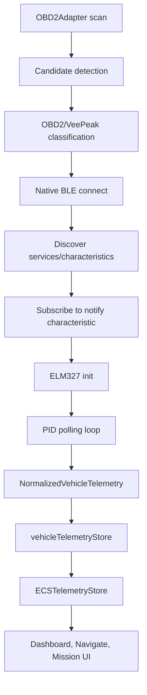

# BLU VeePeak OBD2 Reference Pipeline

This document formalizes the current known-good VeePeak OBD2 path as the ECS reference implementation for live device telemetry. It is documentation and contract work only: the live VeePeak scan, connect, PID polling, store update, and UI paths are intentionally left intact.

## Reference Status

VeePeak OBD2 is the current known-good live BLU-adjacent telemetry path:

1. The adapter appears during BLU/OBD discovery.
2. ECS connects through the native BLE runtime.
3. ECS initializes the ELM327 transport.
4. ECS polls supported OBD2 PIDs.
5. Decoded vehicle telemetry enters `vehicleTelemetryStore`.
6. ECS telemetry and dashboard/navigation consumers render live vehicle data.

Power-device vendors should copy this lifecycle discipline: do not mark a device as live just because it was discovered or connected. A device becomes live only after ECS receives decoded telemetry with a truthful source.

## Shared BLU Telemetry Contract

The shared live telemetry contract lives in `lib/BluTypes.ts`:

- `BluConnectionStatus`
- `BluTelemetryHealth`
- `BluTelemetryEnvelopeSource`
- `BluTelemetryEnvelopeError`
- `BluTelemetryEnvelope<TData>`

Pure helpers for the OBD2 reference path live in `lib/bluTelemetryEnvelope.ts`:

- `buildObd2BluTelemetryEnvelope`
- `buildUnavailableBluTelemetryEnvelope`
- `mapVehicleConnectionStateToBluStatus`
- `resolveBluTelemetryHealth`
- `resolveObd2BluEnvelopeSource`
- `hasDecodedVehicleTelemetry`
- `getObd2BluTelemetryData`

These helpers are side-effect free and do not alter the existing OBD2 runtime path. They define the reusable lifecycle/health model for power-device adapters to adopt.

Reference envelope shape:

```ts
type BluTelemetryEnvelope<TData extends Record<string, unknown> = Record<string, unknown>> = {
  deviceId: string;
  vendor: string;
  deviceType: string;
  connectionStatus: BluConnectionStatus;
  health: BluTelemetryHealth;
  source: 'local-ble' | 'cloud-api' | 'obd2' | 'mock' | 'unknown';
  timestamp: number;
  staleAfterMs: number;
  data: TData;
  error?: {
    phase: string;
    code?: string;
    message?: string;
  };
};
```

## End-to-End Flow



## Discovery

Primary file:

- `src/vehicle-telemetry/OBD2Adapter.ts`

Discovery uses native BLE scanning when available. The OBD2 adapter scans advertised devices, extracts names, local names, service UUIDs, service data, manufacturer data, solicited service UUIDs, and RSSI, then classifies candidates.

VeePeak and related OBD2 naming criteria include:

- `/vee\s*peak/i`
- `/veepeak/i`
- `/ve\s*peak/i`
- `/v\s*peak/i`
- `/\bvpake\b/i`
- `/\bvp\s*11\b/i`
- `/obd/i`
- `/obd\s*check/i`
- `/elm\s*327/i`

Relevant BLE service/transport candidates include:

- `0000ffe0-0000-1000-8000-00805f9b34fb`
- `0000fff0-0000-1000-8000-00805f9b34fb`
- Nordic UART service `6e400001-b5a3-f393-e0a9-e50e24dcca9e`
- Nordic UART write `6e400002-b5a3-f393-e0a9-e50e24dcca9e`
- Nordic UART notify `6e400003-b5a3-f393-e0a9-e50e24dcca9e`

Unified scanner rows are routed through `lib/useUnifiedDeviceConnections.ts`, which combines BLU power discovery, EcoFlow cloud discovery, native BLE discovery, Classic Bluetooth availability messaging, and OBD2 telemetry discovery into the visible device list. OBD2 rows are categorized as `obd` and connected through the vehicle telemetry path.

## Connection

Primary file:

- `src/vehicle-telemetry/OBD2Adapter.ts`

VeePeak connection uses the native BLE manager:

- Stops scanning before connection.
- Calls `connectToDevice(deviceId, { requestMTU: 512, timeout: 15000 })`.
- Discovers all services and characteristics.
- Selects a write/notify transport for ELM327 commands.
- Registers the OBD2 device in `vehicleTelemetryDeviceRegistry`.
- Changes the primary telemetry device to the connected OBD2 adapter.

The adapter does not treat transport connection alone as live telemetry. It moves through service discovery and PID startup first. If PID startup fails, ECS cancels the native connection and returns failure instead of leaving the app in a false-live state.

## ELM327 Initialization

Primary file:

- `src/vehicle-telemetry/OBD2PIDPoller.ts`

The ELM327 initialization sequence is:

```text
ATZ
ATE0
ATL0
ATS0
ATH0
ATSP0
```

The poller then verifies adapter readiness with:

```text
ATI
AT@1
```

Battery voltage is read through:

```text
ATRV
```

ELM command timeout in the adapter is 5000 ms. Initialization failures are surfaced as handshake/timeout failures, not as live telemetry.

## PID Polling

Primary file:

- `src/vehicle-telemetry/OBD2PIDPoller.ts`

`OBD2Adapter.startPidTelemetry()` starts `OBD2PIDPoller` with a 2500 ms poll interval. The poller discovers supported PIDs, requires at least one decoded PID response, then starts the polling loop.

Core PIDs include:

- `0C`: engine RPM
- `0D`: vehicle speed
- `05`: coolant temperature
- `04`: engine load
- `2F`: fuel level
- `0F`: intake temperature
- `1F`: engine runtime
- `11`: throttle position
- `5E`: fuel rate
- `10`: mass air flow

Each successful cycle emits `NormalizedVehicleTelemetry` with:

- `provider: 'obd2'`
- `source: 'bluetooth_obd_live'`
- decoded metric fields such as `engine_rpm`, `vehicle_speed`, `battery_voltage`, and `fuel_level`
- per-PID records in `obd2_values`

## Stream Lifecycle

The runtime stream is:

1. Native BLE notification monitor receives ELM response fragments.
2. `sendElmCommand` writes commands and waits for the prompt/response.
3. `OBD2PIDPoller` parses valid PID responses.
4. `onTelemetry` passes decoded telemetry back to the adapter.
5. The adapter ingests telemetry into `vehicleTelemetryStore`.
6. Store subscribers and ECS telemetry consumers update.

The first decoded packet is the live gate. Connected BLE transport without decoded telemetry remains connected/not decoded or failed, depending on phase and error.

## Stale Telemetry Detection

Primary file:

- `src/vehicle-telemetry/VehicleTelemetryStore.ts`

The store freshness windows are:

- Fresh/live: less than 30 seconds old.
- Grace/recent: up to 90 seconds old.
- Stale: older than 90 seconds.

The shared helper constants mirror that reference:

- `BLU_OBD2_REFERENCE_LIVE_AFTER_MS = 30_000`
- `BLU_OBD2_REFERENCE_STALE_AFTER_MS = 90_000`

`vehicleTelemetryStore` also rejects disabled `mock_dev` telemetry unless the explicit development mock flag is enabled. This keeps VeePeak live telemetry truthful and prevents simulated values from entering production-live UI state.

## Store Update Path

Primary files:

- `src/vehicle-telemetry/VehicleTelemetryStore.ts`
- `src/telemetry/telemetryAdapters.ts`
- `src/telemetry/ECSTelemetryStore.ts`

The OBD2 path enters ECS state through:

1. `OBD2PIDPoller` emits `NormalizedVehicleTelemetry`.
2. `OBD2Adapter` forwards the decoded payload.
3. `vehicleTelemetryStore.ingest()` stores the latest reading.
4. `vehicleTelemetryStore.recomputeSummary()` updates the vehicle telemetry summary and snapshot.
5. `vehicleTelemetryToEcsTelemetryEvents()` converts vehicle telemetry into ECS telemetry events.
6. `ecsTelemetryStore.ingestEvents()` publishes normalized telemetry for broader ECS consumers.

Key store fields and snapshots:

- `latestTelemetry`
- `summary`
- `snapshot`
- `connectionState`
- `freshnessLabel`
- `isFresh`
- `isStale`
- `isWithinGraceWindow`
- `isShowingLastKnown`

## UI Consumers

Primary consumers include:

- `app/power/blu.tsx`
- `app/vehicle-telemetry-settings.tsx`
- `components/dashboard/VehicleTelemetryWidget.tsx`
- `components/dashboard/WidgetRenderers.tsx`
- `components/navigate/TelemetryHUD.tsx`
- `components/mission/VehicleTelemetry.tsx`
- `src/telemetry/useECSTelemetry.ts`
- `lib/vehicleDisplayStore.ts`

Dashboard and widget surfaces should prefer normalized snapshot/source truth over raw numbers. The live badge should come from source/freshness/connection status, not from the mere presence of voltage, speed, or fuel values.

## Disconnect Lifecycle

Primary file:

- `src/vehicle-telemetry/OBD2Adapter.ts`

Disconnect cleanup:

- Stops reconnect timers.
- Stops health checks.
- Stops PID telemetry.
- Removes notification monitors.
- Cancels pending ELM commands.
- Cancels the native BLE connection.
- Updates device/service state to disconnected.
- Clears `vehicleTelemetryStore`.

This is the pattern other vendors should copy: stop the stream, cancel pending async work, mark the device unavailable, and clear or age live state so stale packets cannot remain marked live.

## Reconnection Behavior

Primary file:

- `src/vehicle-telemetry/OBD2Adapter.ts`

Reconnect behavior includes:

- Last connected OBD2 device persistence.
- Maximum of 8 reconnect attempts.
- Native reconnect timeout of 10000 ms.
- Backoff from 1000 ms up to 30000 ms.
- App resume health checks.
- Periodic BLE health checks every 30000 ms.

Successful reconnect starts PID telemetry before signaling reconnected/live state. Failed reconnects remain explicit and bounded.

## What Power Vendors Should Copy

Power-device integrations should copy these VeePeak rules:

- Classify devices deterministically from names, advertised services, manufacturer data, and confidence.
- Keep discovery, connection, handshake, stream, stale, timeout, and disconnect phases explicit.
- Use native/local BLE or cloud transport truthfully as `source`.
- Treat the first decoded telemetry packet as the live gate.
- Emit a `BluTelemetryEnvelope` with connection status, health, source, timestamp, stale window, decoded data, and phase errors.
- Use stable freshness windows and visible stale/unavailable states.
- Bound reconnect attempts and clear pending timers/subscriptions on disconnect.
- Never mark a device live from cloud authorization, BLE connection, or remembered device state alone.
- Never blend mock telemetry into production-live state.

## What Power Vendors Should Not Copy

Do not copy these anti-patterns into power integrations:

- "Connected" UI state that implies live telemetry before decoded values exist.
- Mock values as fallback for a real device.
- Secret-bearing raw cloud responses in logs or telemetry envelopes.
- Unbounded retry loops.
- Stream timers that survive disconnect.
- UI-specific business logic hidden inside provider adapters.

## Reference File Map

Discovery and classification:

- `src/vehicle-telemetry/OBD2Adapter.ts`
- `lib/useUnifiedDeviceConnections.ts`
- `lib/bluetoothDeviceRouting.ts`
- `lib/bluetoothBrandRegistry.ts`

Connection and handshake:

- `src/vehicle-telemetry/OBD2Adapter.ts`
- `src/vehicle-telemetry/OBD2PIDPoller.ts`
- `src/vehicle-telemetry/VehicleTelemetryService.ts`
- `src/vehicle-telemetry/VehicleTelemetryDeviceRegistry.ts`

Telemetry normalization:

- `src/vehicle-telemetry/OBD2PIDPoller.ts`
- `src/vehicle-telemetry/VehicleTelemetryTypes.ts`
- `lib/bluTelemetryEnvelope.ts`

Store and ECS telemetry bridge:

- `src/vehicle-telemetry/VehicleTelemetryStore.ts`
- `src/telemetry/telemetryAdapters.ts`
- `src/telemetry/ECSTelemetryStore.ts`

UI consumers:

- `components/dashboard/VehicleTelemetryWidget.tsx`
- `components/dashboard/WidgetRenderers.tsx`
- `components/navigate/TelemetryHUD.tsx`
- `components/mission/VehicleTelemetry.tsx`
- `app/vehicle-telemetry-settings.tsx`
- `app/power/blu.tsx`

## Current Risk Notes

- Live hardware verification is still required after any native BLE or OBD2 dependency change.
- Expo Go cannot validate the native BLE path; VeePeak verification requires a native/dev build.
- The helper envelope is not wired into every vendor yet. It is the formal contract for the next BLU power-device work.
- Power vendors with cloud-only or parser-incomplete paths must not claim parity with VeePeak until they decode real telemetry and emit equivalent lifecycle/health state.
