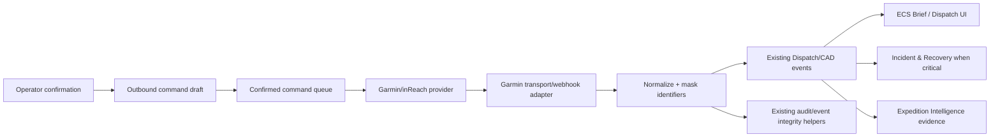

# Garmin/inReach Integration Fit Map

This map identifies additive ECS extension points for a future Garmin/inReach workflow integration. It is discovery-only: no runtime wiring, refactors, deletions, or global behavior changes are proposed here.

## Existing ECS Systems Found

| Area | Existing modules / surfaces | Fit for Garmin/inReach |
| --- | --- | --- |
| Expedition lifecycle | `lib/ai/expeditionIntelligenceTypes.ts`, `lib/ai/expeditionPhaseEngine.ts`, `lib/expeditionStateStore.ts`, `lib/expeditionCommandStore.ts`, `lib/expeditionEventStore.ts`, `lib/expeditionForecastEngine.ts`, `lib/expeditionRiskEngine.ts`, `lib/expeditionPreflightRoutePacket.ts`, `components/expedition/*`, `app/expedition-*` | Lifecycle phases already cover Plan, Prepare, Brief, Navigate, Adapt, Recover, Debrief, Learn. inReach events can be normalized into active expedition context without adding Garmin fields to core expedition models. |
| Expedition agents | `lib/ai/expeditionAgentRegistry.ts`, `lib/ai/expeditionPromptRegistry.ts`, `lib/ai/expeditionIntelligenceOrchestrator.ts`, `lib/ai/expeditionIntelligenceContextBuilder.ts`, `lib/ai/recoveryIncidentAgent.ts` | Existing agents include Expedition Planner, Route Risk, Camp & Logistics, Convoy Command, Recovery & Incident, Debrief Intelligence, and Community QA. Garmin data should enter as evidence/context, not as a new agent by default. |
| Route risk / navigation | `lib/routeAnalysisEngine.ts`, `lib/routeContextEngine.ts`, `lib/routeRecommendationEngine.ts`, `lib/routeStore.ts`, `lib/navigateRouteSessionStore.ts`, `lib/ai/expeditionRouteConfidenceEngine.ts`, `components/navigate/*` | inReach location/tracking can enrich route progress, stale-data warnings, convoy accountability, and route confidence once normalized. |
| Brief / advisory feed | `lib/briefCadLogStore.ts`, `lib/missionBriefEngine.ts`, `components/dashboard/MissionBriefCadLog.tsx`, `components/dashboard/MissionBriefCard.tsx`, `lib/ai/ecsBriefTypes.ts` | Good surface for operator-readable inbound satellite messages, tracking status, and SOS review notices. Keep ECS Brief as the single feed rather than a Garmin-specific panel. |
| Dispatch / CAD | `lib/dispatchTypes.ts`, `lib/dispatchLiveEvents.ts`, `lib/dispatchEventStore.ts`, `lib/dispatchServiceAdapters.ts`, `lib/dispatchCadEventBackendAdapter.ts`, `components/dispatch/*`, `app/expedition-dispatch.tsx` | Strongest integration point. Garmin inbound events should normalize to existing event types such as `team_ping`, `assistance`, `route`, `sync`, and CAD `check_in`/`ping`/`assist`. |
| Convoy / team tracking | `lib/teamStore.ts`, `lib/dispatchCheckInAdapter.ts`, `lib/dispatchChannelState.ts`, `lib/dispatchLiveAggregator.ts`, `components/dispatch/DispatchTeamRosterSection.tsx`, `components/dispatch/DispatchTeamPingComposer.tsx` | inReach check-ins and messages can strengthen convoy accountability. Avoid direct Garmin assumptions in team member records; attach source metadata at the adapter/event layer. |
| Incident / SOS / recovery | `lib/incidentRecoveryWorkflowStore.ts`, `lib/incidentRecoveryContextAdapter.ts`, `lib/incidentCommunicationPacket.ts`, `components/dashboard/IncidentRecoveryPanel.tsx`, `components/dashboard/ReportIncidentModal.tsx`, `components/dashboard/IncidentTimelineModal.tsx` | SOS codes should become critical incident signals requiring human review. Do not automate SOS confirm/cancel. Use existing incident/recovery workflow for operator action. |
| Device / asset registry | `lib/BluDeviceRegistry.ts`, `lib/BluProviderRegistry.ts`, `lib/EcsProviderRegistry.ts`, `lib/unifiedDeviceDiscoveryAggregator.ts`, `src/vehicle-telemetry/VehicleTelemetryDeviceRegistry.ts`, `src/power/drivers/DriverRegistry.ts` | Existing registry patterns support provider-specific adapters. A Garmin registry adapter can be added without changing BLU/power or vehicle telemetry models. |
| Messaging / notifications | `lib/dispatchNotificationAdapter.ts`, `lib/deviceConnectionScanMessaging.ts`, `lib/deviceConnectionRequestPolicy.ts`, `lib/dispatchPermissionAdapter.ts`, campsite notification services | Use existing notification adapters only after permission and confirmation rules are defined. Any outbound inReach message, locate request, or tracking command must require explicit operator confirmation. |
| Map / location / timeline | `lib/expeditionEventStore.ts`, `lib/timelineIntelligenceEngine.ts`, `lib/trailNavigationStore.ts`, `lib/trailHistoryStore.ts`, `components/livelog/EventTimeline.tsx`, `components/expedition/ExpeditionTimelinePanel.tsx`, `components/navigate/RoutePolyline.tsx` | inReach positions can appear as last-known locations and timeline events after normalization. Avoid showing raw IMEI/device IDs. |
| GPX / KML utilities | `lib/gpxParser.ts`, `lib/gpxExport.ts`, `lib/kmlParser.ts`, `lib/kmlExport.ts`, `components/expedition/GpxImportModal.tsx`, `components/expedition/KmlImportModal.tsx` | Existing import/export utilities are available for future inReach track export/import compatibility. No Garmin-specific route model is needed initially. |
| Integration / provider framework | `lib/EcsProviderRegistry.ts`, `lib/BluProviderRegistry.ts`, `lib/useEcsProviders.ts`, `lib/useUnifiedDeviceConnections.ts`, `lib/unifiedDeviceDiscoveryAggregator.ts` | Add a small Garmin provider registration or adapter only if product/API credentials exist. Keep Garmin-specific transport isolated. |
| Event bus | `lib/ecsBus.ts`, `lib/ecsSyncTypes.ts` | Central bus supports debounced channel updates. Potential future path for publishing normalized connectivity/location summaries, but avoid new bus channels unless necessary. |
| Queue / offline sync | `lib/offlineQueue.ts`, `lib/idbQueue.ts`, `lib/syncActionQueue.ts`, `lib/loadoutSyncQueue.ts`, `lib/dispatchOfflineReplayAdapter.ts`, `lib/dispatchSyncAdapter.ts` | Outbound Garmin command drafts could use a dedicated queue with explicit confirmation and idempotency. Do not reuse generic queues until billing/command semantics are understood. |
| Audit log | `lib/dispatchAuditAdapter.ts`, `lib/dispatchIntegrity.ts`, `lib/auth.ts`, Supabase auth migrations | Operator confirmations, command drafts, SOS review decisions, and blocked automation attempts should write audit events through existing audit patterns. |
| Auth / roles | `lib/auth.ts`, `lib/sharedAccountPolicy.ts`, `lib/dispatchPermissionAdapter.ts`, `supabase/migrations/002_ecs_auth_entitlements.sql` | Use existing operator/admin/role patterns for who can view/send/confirm inReach actions. |
| Secrets / backend config | `lib/supabase.ts`, `supabase/config.toml`, Expo env usage in scripts/build output | No dedicated secret manager was found beyond env/Supabase patterns. Garmin credentials should use existing env/Supabase function secret conventions, never client-side hardcoding. |
| Feature flags / rollout | `lib/dispatchRolloutConfig.ts`, `lib/communityCampsitesRolloutConfig.ts`, `lib/fleet/fleetPremiumReleaseConfig.ts`, `lib/garmin/garminInreachConfig.ts` | Garmin-specific flags can remain isolated and default off. Existing rollout config style favors small typed config modules. |
| Existing Garmin scaffold | `lib/garmin/garminInreachTypes.ts`, `lib/garmin/garminInreachConfig.ts`, `lib/garmin/garminInreachAdapter.ts`, `lib/garmin/garminInreachFixtures.ts`, `scripts/test-garmin-inreach-workflow.js` | A small isolated scaffold exists. Future work should extend it rather than moving Garmin assumptions into core ECS domains. |

## Recommended Extension Points

1. **Inbound webhook or polling adapter**
   - Add a transport-specific adapter outside core domain modules.
   - Normalize provider payloads into existing Dispatch live/CAD events.
   - Mask/hash IMEI or device IDs before logging, UI display, or event metadata.

2. **Dispatch/CAD feed**
   - Publish normalized location, message, delivery, tracking, and SOS signals through existing Dispatch event paths.
   - Map normal location to check-in/team ping surfaces.
   - Map SOS to critical assistance/incident review surfaces.

3. **Incident & Recovery**
   - Use existing recovery workflow for SOS review, incident packets, and operator-led escalation.
   - Block SOS confirmation/cancellation automation at the adapter boundary.

4. **Expedition Intelligence Context**
   - Add Garmin/inReach as evidence in `expeditionIntelligenceContextBuilder` only after normalized event storage exists.
   - Keep AI agents explanatory; deterministic status and human operators remain authoritative for safety-critical actions.

5. **Device / integration registry**
   - Add an optional Garmin integration provider entry if ECS needs discoverable connected services.
   - Do not add Garmin to BLU power device types or vehicle telemetry types.

6. **Operator confirmation workflow**
   - Add a command draft/confirmation layer before any outbound message, locate request, tracking change, or emergency-related action.
   - Audit every confirmation and every blocked emergency automation attempt.

7. **Feature flags and secrets**
   - Gate inbound, outbound, and SOS signal handling separately.
   - Store API tokens/webhook secrets through existing env/Supabase function secret mechanisms.

## Files / Modules Safe to Add Without Refactor

These are additive locations that fit the current codebase shape:

- `lib/garmin/garminInreachWebhookAdapter.ts`
- `lib/garmin/garminInreachTransport.ts`
- `lib/garmin/garminInreachCommandQueue.ts`
- `lib/garmin/garminInreachAuditAdapter.ts`
- `lib/garmin/garminInreachDispatchPublisher.ts`
- `lib/garmin/garminInreachDeviceRegistryAdapter.ts`
- `lib/garmin/garminInreachContextEvidence.ts`
- `lib/garmin/__fixtures__/...` or `lib/garmin/garminInreachFixtures.ts`
- `scripts/test-garmin-inreach-*.js`
- `supabase/functions/garmin-inreach-webhook/index.ts` if webhooks are server-side
- `supabase/migrations/*_garmin_inreach_events.sql` only if persistent raw/normalized records are required
- `docs/integrations/garmin-inreach-*.md`

## Suggested Data Flow

## Uncertainties / Missing Pieces

- Garmin/inReach API shape, licensing, webhook availability, rate limits, and chargeable-command semantics are not confirmed in-repo.
- No dedicated secret manager abstraction was found beyond existing environment/Supabase patterns.
- No existing Garmin provider registration is present; current Garmin files are an isolated scaffold only.
- It is unclear whether inbound Garmin events should be persisted as first-class records or only normalized into Dispatch/CAD timelines.
- Command billing policy and operator confirmation copy need product/legal confirmation before outbound commands are wired.
- SOS event codes and cancellation semantics need provider documentation before any handling beyond “critical human review required.”
- Exact role requirements for inReach send/locate/tracking commands are not yet defined; Dispatch permissions are the likely starting point.
- KML/GPX interoperability exists, but no inReach-specific import/export contract is present.

## Non-Goals For First Implementation

- No core Expedition, Dispatch, Incident, AI, route, or device model refactor.
- No automatic SOS confirm/cancel.
- No automatic chargeable Garmin command.
- No raw IMEI/device identifier in logs, UI, public responses, or general metadata.
- No Garmin-specific UI panel unless existing Dispatch/ECS Brief/Incident surfaces cannot represent the workflow.
